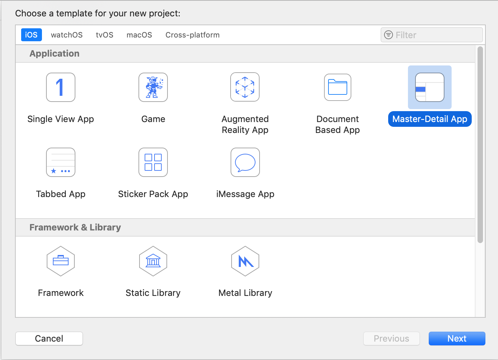
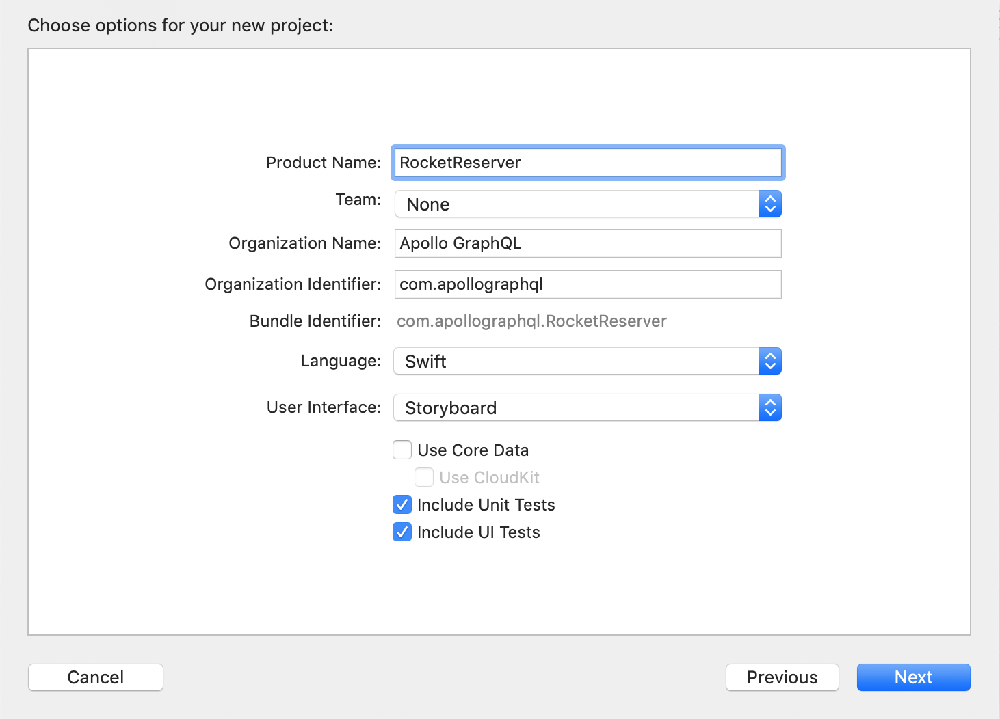
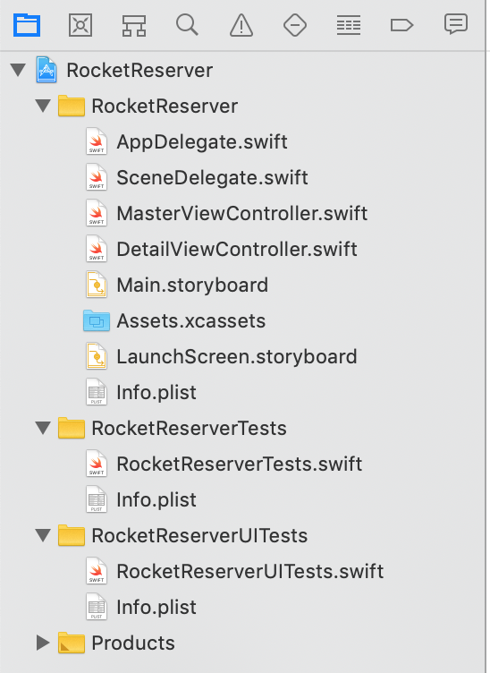

In this part of the tutorial, you'll get set up in a new project with the Apollo iOS SDK, and generate your first code. 

## Starting a new project in Xcode

Open up Xcode. If you see the **Welcome to Xcode** screen, select **Create a new Xcode project**:


If you don't see that screen, go to **File > New > Project...** in the menus: 


Either of those will bring you to the template chooser for a new project. Select **iOS** at the top and **Master-Detail App**:



Then hit **Next**. You'll be brought to the options page for your new project. Name the project **RocketReserver**, make sure the language is **Swift**, and the User Interface is **Storyboards** (sorry, SwiftUI fans!):



It's probably also a good idea in the long term to make sure the unit and UI test checkboxes are checked, but they're not required for this tutorial. Hit **Next**. You'll then be prompted to select where to save your new project. Pick a place on your computer that's easy to find, such as your Desktop, and hit **Finish**.

Xcode will open your new project for you, and you'll see an extremely basic new project:



Next, you'll add a dependency on the `apollo-ios` repo and Apollo libraries using Swift Package Manager, aka SPM. In the menu, go to **File > Swift Packages> Add Package Dependency...**:


This will open a dialog allowing you to select what dependency you wish to add. Add the git URL for the iOS repo, [`https://github.com/apollographql/apollo-ios.git`](https://github.com/apollographql/apollo-ios.git)


Remember the `.git` part, otherwise there could be some weirdness in setting things up later! Hit the **Next** button, and Xcode will check out the repository in git and analyze the library for you. When it's done, it'll show you a panel asking if you want to use up to the next major version of the library. 

While in most cases, this works well, since Apollo is still at v0.x.x, breaking changes can occur in minor versions. Update the dropdown to use the **Next minor** version of the library:


Then hit next. You'll then get a list of the packages which are included with this library. For this tutorial, select the main **Apollo** target and the **ApolloWebSocket** target:


Then hit **Finish**. SPM will go out and fetch your dependencies, and when it completes you'll be able to see them in a separate section of the project navigator: 


> **Note:** Due to Swift Package Manager not having implemented [Target-Based Dependency Resolution](https://github.com/apple/swift-evolution/blob/master/proposals/0226-package-manager-target-based-dep-resolution.md) yet, you'll still see the `SQLite` dependency even though you didn't check the box for `ApolloSQLite`. 

Now you've got your project set up, and the Apollo dependencies added. It's time to start pulling together the things you need to build your API!

## Downloading the schema

For this tutorial, you'll be working with a server that was set up based on [the Apollo full-stack tutorial](https://www.apollographql.com/docs/tutorial/introduction/)'s final project. You can find the site at [`https://n1kqy.sse.codesandbox.io/`](https://n1kqy.sse.codesandbox.io/) - if you click that link, you'll be taken to the `GraphiQL` query explorer: 


Click on the green "Schema" on the right hand side, and you'll see a list of the possible queries and mutations you can run: 


While it's nice to have this available and visible for you to see on the web (and you'll get back to doing more with GraphiQL in a bit), in order for Apollo to generate code for you, you need to have a local copy of the schema. 

Fortunately, the Apollo Command Line Interface (aka our CLI) can handle this for you. It's the same tool that you'll need to run code generation, and it also includes a way to download a schema from a GraphQL endpoint which supports schema introspection (which fortunately, Apollo does!). 

In order to use the CLI, you'll need to set up a Run Script Build Phase with your application. To do that select the `xcodeproj` file in the Project Navigator, and then select the `RocketReserver` application target: 


A list of menu items will appear - select **Build Phases**: 


In the top left hand corner there will be a small **+** button - click on it and select **New Run Script Phase**:


This will add a new Run Script Build Phase to the bottom of your list of build phases. Drag that new phase up between "Dependencies" and "Compile Sources":


Next, double click on the name of the script to rename it - when the highlight appears, rename it **Apollo CLI**:


Next, you'll need to add the run script for the Swift Package manager. It's a little long, but fortunately you can grab it from [the installation instructions for adding a code generation build phase to Swift Package Manager](https://www.apollographql.com/docs/ios/installation/#swift-package-manager-run-script) - hit the "Copy" button on the code block and it'll copy the whole thing. 

Go back to Xcode, and open the flippy triangle on the Apollo CLI build phase you just created. In the large text area, paste in the script you just copied. This is what you'll eventually use to generate code. 

However, first you need to download a schema in order to generate that code. Comment out the last line (don't delete it - you'll come need it in a minute), and then add the following below it: 

```sh
"${SCRIPT_PATH}"/run-bundled-codegen.sh schema:download --endpoint="https://n1kqy.sse.codesandbox.io/"
```

This calls the `schema:download` function of our Apollo CLI, and automatically downloads the schema to the same level of your project as your `.xcodeproj` as a file called **schema.json**. Drag this file from finder into Xcode:


When Xcode offers to add the schema file, make sure **all targets are unchecked**: 


The schema file can get pretty huge depending on how extensive your schema is, and it's only needed for generating the Swift code that will eventually be in your application. Leaving it out of the application target helps reduce bundle bloat. 

You've now got the first piece of the puzzle needed to generate code: The schema. The schema defines the world of what is possible to request from your server. Now you need to create at least one **operation**, which tries to get or update information in your graph. 

## Creating a query

The simplest kind of operation is a **query**, which requests information from your graph based on the schema. If you go back to [the GraphiQL query explorer](https://n1kqy.sse.codesandbox.io/), you'll see the Schema tab you opened earlier. 

Click on the `launches` query at the top to get more details about the query:


In the right panel, you see both the query itself, and information about what the query returns. You can use this information to write a query you'll eventually move to iOS. 

In the left hand section, add the following lines to start creating a query that will get a list of all the launches: 

```graphql
query LaunchList {
}
```

It's valid GraphQL for a query not to have a name, but for iOS, in order to generate code for queries, every query has to have a name, so you might as well add one here.

>**Note**: the word `Query` (or its equivalent for other operations) is automatically added by our iOS code generation. That means you don't need to add that to the name of your query, unless you want it to be called `LaunchListQueryQuery` 😆.

Next, between the curly braces, start typing `la`. You'll see the autocomplete box pop up and show you options based on what's in the schema:


This is a really helpful feature of GraphiQL to help you create queries and check them quickly so you don't have to go through a million rounds of building with Xcode. 

>**Note**: There is a way to get syntax highlighting in Xcode for GraphQL files that uses the Schema to validate things, but changes in Xcode 11 have made this considerably more difficult to use and maintain. Please see [this issue on the Xcode-GraphQL repo](https://github.com/apollographql/xcode-graphql/issues/23) for more details, but for now, GraphiQL is probably going to be a better bet in the short term.

As you can see from the schema, the `launches` endpoint returns a `LaunchConnection` object that has both pagination information and a list of launches. To get the information out of an object which is returned from a query, you must add curly braces to the query, then start requesting fields from the returned object. 

What does this look like in practice? To just ask for the `cursor` and `hasMore` properties of a `LaunchConnection` object, update your query to look like this:


```graphql
query LaunchList {
  launches {
    cursor
    hasMore
  }  
}
```

If you run this query by pressing the big play button in GraphiQL, you'll get a very simple JSON structure in return on the right hand side of the page: 


This is great, but it doesn't give you any information about the launches! That's because that data is in the `LaunchConnection`'s `launches` property, which is an array of `Launch` objects. 

Similarly to how you need to use curly braces to indicate that you want to get the result of a query, you can use curly braces to indicate you want the same information for every item in that array. Update your query to get the `id` and `site` properties for every item in the array:


```graphql
query LaunchList {
  launches {
    cursor
    hasMore
    launches {
      id
      site
    }
  }  
}
```

Run the query again, and you'll now see that in addition to the information you got back before, you're also getting a list of launches with their ID and site information: 


Neato! So how do you use this in your iOS application? First, head back to Xcode. Go to **File > New > File...** and scroll down until you see the **Empty** file template:


Select this template and hit **Next**. Name the file `LaunchList.graphql`, and make sure it's saved at the same level as your `schema.json` file, and that it is also not added to your target. 

This is for the same reason as the schema: It's used to create the code that allows you to have type-safe Swift code, but it isn't necessary to include in the bundle since the swift code will take care of that for you. 

Finally, copy your final query from GraphiQL, and paste it into this file. Now, you have both pieces which can be handed to the Apollo CLI to generate code - it's time to actually generate it.

## Running Code Generation

Go back to your Run Script Build Phase. At the bottom, comment out the line with `apollo:schema` - since you've already got the schema downloaded and it doesn't change frequently, you don't need to frequently fetch it. 

What you will need to do frequently is regenerate code based on queries as you've written them, so that when you add, change, or remove a query, the accompanying code is automatically updated. 

To do this, uncomment the line you commented out earlier containing `codegen:generate`. Now, build your project. It'll churn for a moment, and when it's done, you'll see a nice new `API.swift` file output in your project's directory at the same level as the `.xcodeproj` and the `schema.json`. 

Drag this file into Xcode. This time, you **do** need to check the "Add to target" box for the `RocketReserver` app - this is the puzzle piece which will actually get included in your application's bundle and which will allow you to take advantage of all the work you just did. 

>**Note**: If you've got a super-giant API file and want it split into smaller files, there's [a way to do that with advanced code generation](https://www.apollographql.com/docs/ios/installation/#generate-multiple-files-in-a-folder-instead-of-one-giant-file). For the purposes of this tutorial though, it's not going to get *that* big. 

Take a look inside the `API.swift` file. You'll see that it has a root class, `LaunchListQuery`, and it's got a bunch of nested structs below it. Compare the structs to the JSON data returned in GraphiQL: It's the same structure! And these structs are set up to only have properties for fields you've requested. 

For instance, try commenting out the `id` property in `LaunchList.graphql`, saving, then building again. You'll see when the build completes that the innermost `Launch` now only has the built in `__typename` and the requested `site` properties. 

Comment `id` back in, rebuild, and the property for `id` comes back when the build finishes. This helps prevent you from accidentally trying to access a property which isn't included in the result for your particular query. 

Now that you've generated code and had a chance to see what's in there, it's time to get everything working end to end!

## Running a test query

To use the generated operations that get put into `API.swift`, you need to use an instance of `ApolloClient`. This is the thing which will take that generated code and use it to make raw network calls. 

Note that you need something to hang on to your instance of `ApolloClient`, or calls will self-terminate before completing. The easiest way to do this is to use a singleton, or a single static instance of a class you can access from anywhere in your codebase.

Start by copying the code in the [basic client creation section of our guide on creating a client](https://www.apollographql.com/docs/ios/initialization/#basic-client-creation). You'll then want to update the URL string to be `https://n1kqy.sse.codesandbox.io/` instead of the `localhost` url shown in the example.

To make sure the Apollo client is communicating correctly with the server, add a call using your `LaunchListQuery` to `AppDelegate.swift` in the `application:didFinishLaunchingWithOptions` method so that it runs when the application is started. 

Just above the `return true`, in that method, add the following code: 

```swift
Network.shared.apollo.fetch(query: LaunchListQuery()) { result in
  switch result {
  case .success(let graphQLResult):
    print("Success! Result: \(graphQLResult)")
  case .failure(let error):
    print("Failure! Error: \(error)")
  }
}
```

Build and run your application. CodeSandbox may need to take ~10-30 seconds to spin up the application if nobody's been using it recently, but once it's spun up you should see a response pretty quickly which looks something like this: 


Hooray! You're now successfully fetching data from the network using the generated code!

## Recap

In this part of the tutorial, you have: 

- Created a new Xcode project and added the `apollo-ios` SDK to it using Swift Package Manager.
- Added a run script build phase so you can call the Apollo CLI easily.
- Downloaded the schema you're going to use to validate your operations.
- Created your first query.
- Set up code generation 
- Created a singleton to access your `ApolloClient`
- Used that singleton to run your query against the live server.

Now it's time to move on to [actually displaying some of those query results in your UI with Part 2](tutorial_2)!